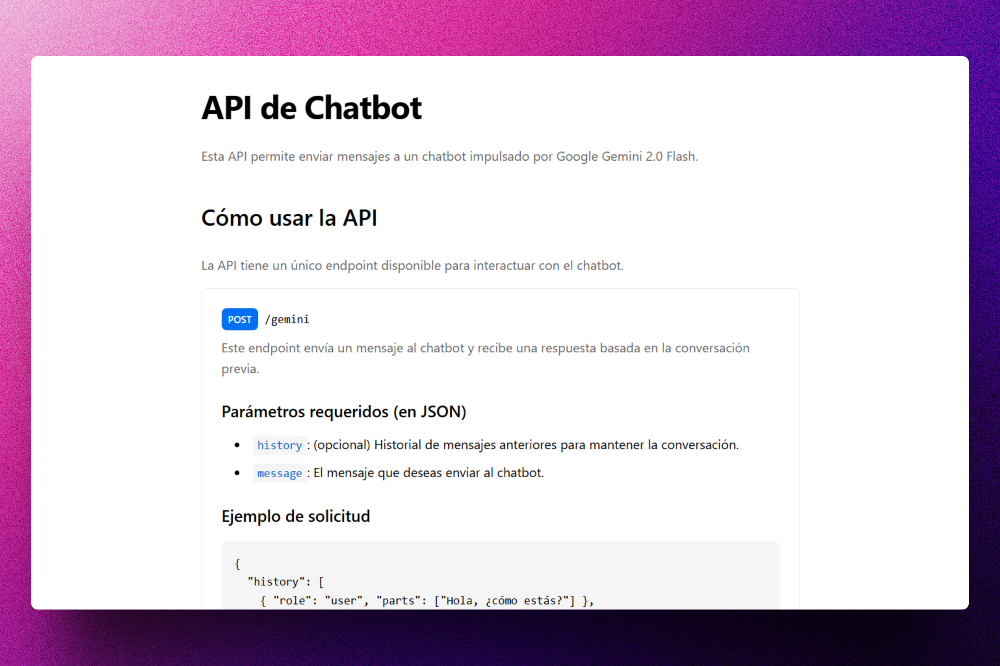
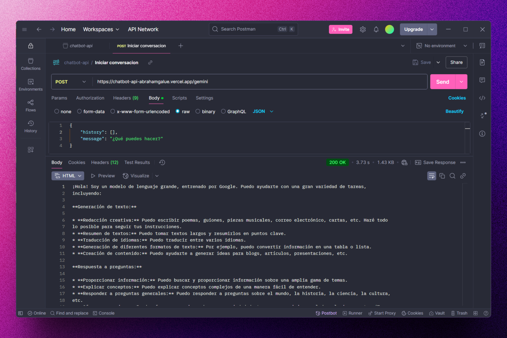

<div align='center'>

# 🤖 NODE/EXPRESS: ChatBot API

</div>

### API para mantener una conversación con un chatbot.

> 🧩 Aquí puedes ver su [**Live Demo.**](https://chatbot-api-abrahamgalue.vercel.app/)





## 🚀 Descripción

Este proyecto de curso utiliza el modelo Gemini para crear un chatbot que puede mantener una conversación con los usuarios. La API permite a los usuarios enviar mensajes y recibir respuestas del chatbot.

Si quieres ver una implementación real, puedes visitar [**ChatBot AI**](https://gemini-ai-chatbot-abrahamgalue.pages.dev/).

## ⚡ Comenzar

### Prerrequisitos

1. Git.
2. Node.js: cualquier versión a partir de la 20 o superior.

## 🔧 Instalación

### Usando npm

1. **Clona el repositorio:**

   ```bash
   git clone https://github.com/abrahamgalue/chatbot-api.git
   cd chatbot-api
   ```

2. **Instala las dependencias:**

   ```bash
   npm install
   ```

### Ejecución local (modo desarrollo)

1. **Inicia el servidor de desarrollo:**

   ```bash
   npm run dev
   ```

   Esto iniciará el servidor de desarrollo en Express y tu aplicación estará disponible en `http://localhost:3000`.

   > **Nota:** Para que tu applicación funcione correctamente, asegúrate de tener configurada la variable de entorno `GOOGLE_GEN_AI_KEY` con tu [**clave de API de Google**](https://ai.google.dev/gemini-api/docs/api-key). Puedes crear un archivo `.env` en la raíz del proyecto y agregar la siguiente línea:

   ```bash
   GOOGLE_GEN_AI_KEY=tu_clave_de_api
   ```

## 🎭 Tecnologías

El proyecto utiliza las siguientes tecnologías:

- [**Express**](https://expressjs.com/) como framework de Node.js.
- [**Google Gen AI SDK**](https://www.npmjs.com/package/@google/genai) para interactuar con el modelo Gemini.
